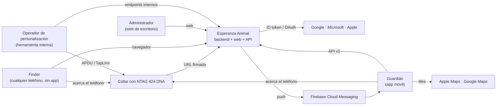
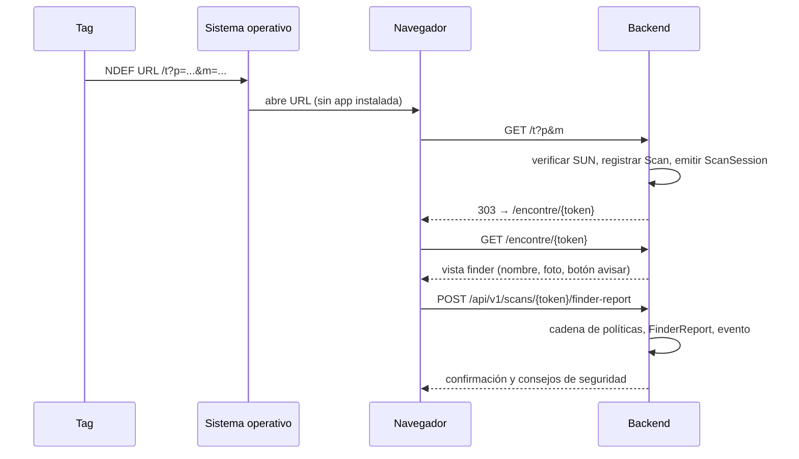
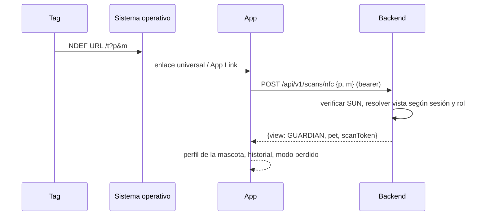

# 02 · Arquitectura del sistema

## 1. Vista de contexto



## 2. Contenedores

| Contenedor | Tecnología | Responsabilidad | Repositorio |
|---|---|---|---|
| Backend y web | Next.js 16, Prisma 7, PostgreSQL 16, Better Auth | Reglas de negocio, Server Actions de la web, API v1, páginas del flujo de hallazgo, administración, cron interno | `esperanza-animal` |
| Almacén de fotos | Volumen persistente `UPLOADS_DIR` | WebP por propietario, servido por `/fotos/{id}` | `esperanza-animal` |
| App móvil | React Native, Expo, TypeScript | Pantallas para guardianes y comunidad; consumo de API v1; enlaces profundos; push; NFC en primer plano | este repo |
| Herramienta de personalización | Kotlin, TapLinx | Personalización de tags con llaves derivadas por el backend | repo interno |
| Contrato | OpenAPI generado desde Zod | Fuente única de tipos para clientes | `esperanza-animal`, publicado por versión |
| Proveedores externos | OAuth, FCM, tiendas, mapas | Identidad, push, distribución, cartografía | — |

El backend sigue siendo **un monolito modular por features**. No se crean servicios
separados: la API v1 es una capa de entrada más, junto a las Server Actions, sobre los
mismos `service.ts`.

## 3. Backend

### 3.1 Capas por feature (convención existente, se conserva)

```
features/<feature>/
  actions.ts     Server Actions para la web: validar → sesión → service
  routes.ts      NUEVO: handlers de API v1 para móvil: validar → sesión bearer → service
  schemas.ts     Zod compartido por actions, routes, contrato y pruebas
  service.ts     Reglas de negocio y transacciones Prisma ("server-only")
  queries.ts     Lecturas
  constants.ts   Parámetros de producto de la feature
  events.ts      NUEVO cuando aplica: eventos de dominio que emite
  components/    UI de la web
```

Las dos entradas (`actions.ts`, `routes.ts`) son delgadas y equivalentes. Una regla que
solo exista en una de ellas es un defecto.

### 3.2 Features existentes y nuevas

| Feature | Estado | Cambios previstos |
|---|---|---|
| `account`, `admin`, `alerts`, `auth`, `colonias`, `feed`, `lifecycle`, `map`, `onboarding`, `profile`, `publications`, `push`, `reports`, `sightings` | existen | Agregar `routes.ts`; paginación por cursor en feed y alertas; `Publication.petId`; tipos de alerta nuevos; el push pasa a un puerto de notificación |
| `pets` | nueva | Mascotas, fotos, estado, código público, preferencias de visibilidad, modo perdido |
| `guardians` | nueva | Guardianes, invitaciones, transferencias |
| `tags` | nueva | Lotes, tags, asignaciones, máquina de estados, silencio, revisión |
| `scans` | nueva | Verificación de lecturas, tokens de escaneo, niveles de confianza, resolución de vista |
| `finder` | nueva | Avisos de hallazgo, políticas anti-abuso, páginas web `/encontre/{token}` y `/q/{code}` |
| `devices` | nueva | Registro de dispositivos para push nativo |
| `provisioning` | nueva | Endpoints internos para la herramienta de personalización |
| `lib/nfc` | nueva | Primitivas SUN: descifrado PICCData, diversificación, CMAC. Sin Prisma ni HTTP |
| `lib/crypto` | nueva | Cifrado por campo, cifrado de sobre, HMAC, puerto `KeyProvider` |
| `lib/api` | nueva | Envoltura de handlers, Problem Details, sesión bearer, rate limit, generación OpenAPI |
| `lib/notifications` | nueva | Puerto `NotificationChannel` y adaptadores Web Push, FCM y APNs |

### 3.3 Handler de API v1

Todo endpoint se declara con una función de fábrica que fija el orden: esquema de entrada,
política de sesión, límite de tasa, función de servicio, esquema de salida. La misma
declaración alimenta el documento OpenAPI. Un handler nunca contiene lógica de negocio.

```
defineRoute({
  method, path, summary,
  input: { params?, query?, body? },      // Zod
  output: { 200: schema, 4xx: problem },  // Zod
  auth: "public" | "session" | "admin" | "scanToken",
  rateLimit: RATE_LIMIT_PROFILE,
  handler: (ctx) => service(...)
})
```

Errores: `application/problem+json` con `type`, `title`, `status`, `detail` y `code`
estable para que la app traduzca mensajes sin depender del texto.

### 3.4 Patrones de diseño y dónde se aplican

| Patrón | Dónde | Por qué |
|---|---|---|
| Puertos y adaptadores | `KeyProvider` (env hoy, KMS mañana); `NotificationChannel` (Web Push, FCM); `PhotoStorage` (disco hoy, S3 mañana) | Cambiar proveedor sin tocar dominio |
| Estrategia | Nivel de confianza del escaneo; resolución de vista (guardián, finder, neutra); política de visibilidad del perfil público | Variantes con la misma interfaz, sin condicionales dispersos |
| Máquina de estados explícita | `Tag.status`, `Pet.status`, `PetTransfer.status` | Tabla de transiciones válidas; lo que no está en la tabla es error de dominio |
| Cadena de responsabilidad | Políticas anti-abuso del aviso de hallazgo | Orden claro, cada política rechaza con motivo registrable |
| Eventos de dominio en proceso | `ScanVerified`, `FinderReportCreated`, `PetLostModeActivated`, `PetFound` | Alertas y push como efectos secundarios que nunca tumban la acción principal, como ya hace `alerts/service.ts` |
| Fábrica | `defineRoute`, cliente OpenAPI en la app | Construcción uniforme y documentación derivada |
| Repositorio | En la app: un repositorio por feature sobre el cliente generado y la caché de consultas | La UI no conoce HTTP |
| Especificación en Zod | Todos los esquemas de entrada y salida | Una sola definición para validación, contrato y pruebas |

### 3.5 Eventos de dominio

Un despachador en proceso, síncrono y con manejo de errores por suscriptor. No se
introduce cola externa: con una réplica y efectos idempotentes es suficiente, y es la
misma decisión que el proyecto tomó para el rate limit y el cron interno.

Regla de uso: lo que debe ocurrir sí o sí junto con la acción (crear el caso al activar
modo perdido, cerrarlo al confirmar el regreso) va en la misma transacción como llamada
directa entre servicios, no como evento. Los eventos son para efectos secundarios que no
pueden tumbar la acción principal: alertas, push, contadores de sospecha. En S3 esas
alertas usan las funciones existentes de `alerts/service`; el despachador se introduce
en S4, cuando aparece más de un suscriptor por evento.

| Evento | Emisor | Suscriptores |
|---|---|---|
| `ScanVerified` | `scans` | `tags` (actualiza contador, replays), `alerts` (escaneo de collar si la mascota está en casa) |
| `FinderReportCreated` | `finder` | `alerts` (aviso de hallazgo a guardianes con prioridad según estado), `devices` (push) |
| `PetLostModeActivated` | `pets` | `publications` (crea el caso prellenado), `alerts` |
| `PetFound` | `pets` | `publications` (marca encontrada), `alerts` (buenas noticias, existente) |
| `TagSuspicionReported` | `finder` | `tags` (pasa a `EN_REVISION`), `admin` (cola) |

## 4. Flujos clave

### 4.1 Finder sin app acerca el teléfono



### 4.2 Guardián con app acerca el teléfono



Si la sesión no es de un guardián de esa mascota, la respuesta es `view: FINDER` y la app
muestra la misma pantalla que la web. Si el tag no está `ACTIVO`, `view: NEUTRAL`.

### 4.3 Activación de collar

1. El dueño abre «Activar collar» en la app y acerca el teléfono.
2. La app recibe el enlace, llama a `POST /api/v1/scans/nfc` y obtiene `scanToken` con
   `tagStatus: LISTO`.
3. La app pide elegir la mascota y llama a `POST /api/v1/tags/activate` con `scanToken`
   y `petId`.
4. El servicio valida: token vigente, tag `LISTO`, usuario es `DUENO` de la mascota.
   Transición `LISTO → ACTIVO`, `TagAssignment` nuevo, bitácora.

### 4.4 Modo perdido

1. `POST /api/v1/pets/{id}/lost` con la aceptación de los avisos 3d y 3e.
2. `Pet.status → PERDIDA`, evento `PetLostModeActivated`.
3. `publications` crea el caso con nombre, especie, descripción y copia de las fotos,
   `petId` enlazado, y aplica las reglas existentes (colonia seleccionable, límite diario).
4. Desde ese momento, un aviso de hallazgo llega con prioridad alta.

### 4.5 Personalización de un tag

1. El operador inicia sesión en la herramienta con su cuenta de administrador.
2. Lee el UID del chip y verifica originalidad.
3. `POST /api/v1/internal/tags/{uid}/keys` devuelve las cinco llaves derivadas y la
   `keyVersion` vigente; el backend registra la solicitud.
4. La herramienta autentica con la llave de fábrica, cambia las llaves, configura SUN y
   escribe la URL plantilla.
5. Hace una lectura de prueba y llama a `POST /api/v1/internal/tags/{uid}/provisioned`
   con el resultado; el backend verifica esa lectura y marca `LISTO`.

### 4.6 Entrega de push

`alerts/service` crea la fila `Alert` como hoy y publica al puerto `NotificationChannel`.
Los adaptadores FCM (Android) y APNs (iOS) buscan los `Device` del usuario por
plataforma, arman el mensaje con prioridad y canal, y eliminan tokens que el proveedor
reporte como no registrados, igual que hoy se eliminan las suscripciones Web Push con
404 o 410. El adaptador Web Push existente se reescribe sobre el mismo puerto.

## 5. Resolución de vista para una URL de tag

| Condición | Vista | Contenido |
|---|---|---|
| Tag `ACTIVO`, sesión de guardián de la mascota | `GUARDIAN` | Perfil completo, historial de escaneos, modo perdido, vista previa pública |
| Tag `ACTIVO`, cualquier otro caso | `FINDER` | Nombre, foto, estado, botón avisar; teléfono solo con opt-in |
| Tag `LISTO`, sesión de cualquier usuario | `ACTIVATION` | Invitación a activar el collar si tiene mascotas |
| Tag `LISTO` sin sesión, `EN_REVISION`, `REVOCADO`, desconocido o firma inválida | `NEUTRAL` | Pantalla neutra sin información del tag |

La resolución es una estrategia con una entrada: `{ tagStatus, viewerRole }`.

## 6. App móvil (resumen; detalle en el documento 06)

Cliente delgado: navegación, estado de pantalla, caché de consultas, cámara, ubicación,
push, NFC en primer plano, enlaces. Ninguna regla de negocio se decide en la app; la app
valida formularios con los mismos esquemas que expone el contrato para dar feedback
inmediato, pero el servidor es la autoridad.

## 7. Transversales

| Tema | Decisión |
|---|---|
| Configuración | Backend: `env-schema.ts` valida al arrancar (existente); se amplía. App: configuración de build tipada y validada al arrancar; valores públicos por `EXPO_PUBLIC_*`, secretos de build en EAS. |
| Configuración remota | `GET /api/v1/config`: versión mínima soportada, proveedores habilitados, municipios activos, límites de producto que la app necesita para validar en local. |
| Errores | Problem Details con `code` estable. La app mapea `code` a textos en `es-MX`. |
| Logs | Sin datos personales. Identificador de correlación por petición que la app envía en cabecera. |
| Idioma | `es-MX` en backend y app; textos por feature en módulos, no en componentes. |
| Versionado de API | Prefijo `/api/v1`. Cambios incompatibles abren `/api/v2`; los compatibles se agregan. |
| Fechas | ISO 8601 en UTC en el contrato; formato local en la app. |
| Identificadores | `cuid` como el resto del esquema; códigos públicos aparte y no derivables del id. |

## 8. Relación con la web actual

- Las Server Actions siguen sirviendo a la web. No se migran a la API; se comparten los
  `service.ts`.
- Las páginas del flujo de hallazgo (`/encontre/{token}`, `/q/{code}`) y la pantalla neutra
  son páginas Next.js nuevas, ligeras, sin el nav de la app web.
- El cartel imprimible, la privacidad y la eliminación de cuenta se reutilizan como
  páginas web abiertas desde la app cuando corresponde.
- El TWA se reemplaza por la app nativa con el mismo identificador; `manifest.ts` y
  `sw.js` siguen sirviendo a la PWA en navegadores.

## 9. Riesgos y decisiones abiertas

| Riesgo | Mitigación | Estado |
|---|---|---|
| Rango de lectura corto de la antena de 11 mm | Pruebas físicas del documento 10; instrucciones en el empaque | Pendiente de chips |
| Teléfonos sin NFC | Camino QR sin verificar (ADR-008) | Diseñado |
| Sin Mac para iOS | EAS Build; App Clip diferido | Aceptado |
| Chips falsificados en el lote | Verificación de originalidad y revocación por lote | Diseñado |
| Un solo desarrollador para backend y app | Plan por secciones con criterios de aceptación; contrato como frontera | Aceptado |
| Proveedor de mapas | MapKit y Google Maps por defecto; MapLibre como alternativa detrás del mismo adaptador | Decidir en S11 con costos vigentes |
| Cooldown de avisos por IP detrás de NAT de operadora (dos finders distintos con la misma IP pública) | La app manda `x-device-id`; la web de finder no. Se vigila la tasa de `scan.cooldown` en producción y, si molesta, la web genera un identificador por navegador | Aceptado (S4) |
| Moderación con una sola persona a escala nacional | `municipio.active` como interruptor de apagado y búsqueda por municipio en administración (hecho en S18); moderadores regionales cuando haya volumen | Vigilar |
| Teléfono del finder en claro hasta S5 | S5 se ejecuta antes de cualquier prueba con personas reales | Pendiente (S5) |
