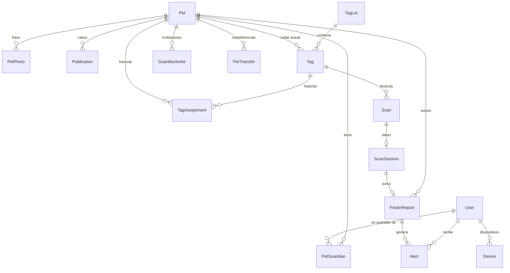

# 03 · Modelo de datos

Extiende el esquema Prisma existente del proyecto web. Nada de lo existente se
reescribe: se agregan modelos, columnas y valores de enumeración, y se migra un campo
sensible al esquema cifrado. Convenciones heredadas: `cuid()` como identificador, nombres
de modelo en inglés, valores de enumeración en español, `@@map` a tablas en `snake_case`.

## 1. Esquema existente que se conserva

`User`, `Session`, `Account`, `Verification` (Better Auth), `Municipio`, `Colonia`,
`UserProfile`, `Publication`, `PublicationPhoto`, `Report`, `Sighting`, `Alert`,
`PushSubscription`, `AdminActionLog` y los enums `Species`, `PublicationStatus`,
`ReportReason`, `ReportStatus`, `AlertType`, `AdminActionType`. Sus campos, índices y
reglas están en el código del repo web y no se repiten aquí.

## 2. Diagrama de entidades



## 3. Cambios sobre modelos existentes

| Modelo | Cambio | Motivo |
|---|---|---|
| `User` | Relaciones nuevas: `guardianOf PetGuardian[]`, `devices Device[]`, `transfersSent`, `invitesCreated` | Navegación Prisma |
| `UserProfile` | `contactPhoneEnc String?`, `contactPhoneHmac String?` con índice, `altPhoneEnc String?`, `emergencyNameEnc String?`, `emergencyPhoneEnc String?` | RF-B2, ADR-004 |
| `Publication` | `petId String?` con relación a `Pet` (`onDelete: SetNull`) e índice | RF-C5 |
| `Publication` | `phone String` pasa a `phoneEnc String` con el formato cifrado; migración con relleno | Consistencia con ADR-004: hoy el teléfono de contacto está en claro |
| `Alert` | `petId String?`, `finderReportId String?` con relación | RF-I2 |
| `AlertType` | Nuevos: `AVISO_HALLAZGO`, `ESCANEO_COLLAR`, `TRANSFERENCIA_MASCOTA` | RF-I2 |
| `AdminActionType` | Nuevos: `EMITIR_LLAVES_TAG`, `MARCAR_TAG_LISTO`, `REVOCAR_TAG`, `REVOCAR_LOTE`, `RESOLVER_REVISION_TAG`, `REASIGNAR_TAG`, `RESOLVER_TRANSFERENCIA`, `DESCIFRAR_CONTACTO` | RF-K2, RF-K4 |

`PushSubscription` se conserva para la web. El registro móvil es `Device`.

## 4. Modelos nuevos

### `Pet` → `pet`

| Campo | Tipo | Notas |
|---|---|---|
| `id` | `String @id @default(cuid())` | |
| `name` | `String` | Límite `NAME_MAX_LENGTH` |
| `species` | `Species` | Enum existente |
| `speciesDetail` | `String?` | Obligatorio si `OTRO`, como en publicaciones |
| `sex` | `PetSex @default(DESCONOCIDO)` | |
| `description` | `String` | Señas; límites de descripción de publicación |
| `birthDate` | `DateTime?` | Aproximada |
| `sterilized` | `Boolean?` | Desconocido si nulo |
| `microchipCode` | `String?` | Límite `MICROCHIP_CODE_MAX_LENGTH` |
| `medicalNotes` | `String?` | Límite `MEDICAL_NOTES_MAX_LENGTH` |
| `showPhoneToFinder` | `Boolean @default(false)` | RF-C7 |
| `showMedicalNotes` | `Boolean @default(false)` | RF-C7 |
| `status` | `PetStatus @default(EN_CASA)` | Máquina de estados |
| `lostSince` | `DateTime?` | Se fija al entrar a `PERDIDA` |
| `publicCode` | `String @unique` | Para QR y enlace público; `PET_PUBLIC_CODE_LENGTH`, generado con aleatoriedad criptográfica |
| `createdAt`, `updatedAt` | `DateTime` | |

Índices: `@@index([status])`. Relaciones: `photos`, `guardians`, `tags`, `tagAssignments`,
`publications`, `scans`, `finderReports`, `invites`, `transfers`.

### `PetPhoto` → `pet_photo`

`id`, `petId` (Cascade), `position Int`, `createdAt`. Índice `[petId, position]`.
Archivo en `{UPLOADS_DIR}/pets/{petId}/{id}.webp`. El módulo de almacenamiento recibe un
**ámbito** (`user` o `pet`) en lugar de asumir siempre un usuario; el resolvedor de
`/fotos/{id}` agrega `PetPhoto` y `FinderReport` a su cadena de búsqueda.

### `PetGuardian` → `pet_guardian`

`id`, `petId` (Cascade), `userId` (Cascade), `role GuardianRole`, `createdAt`.
`@@unique([petId, userId])`. Índice único parcial en SQL: un solo `DUENO` por mascota
(`CREATE UNIQUE INDEX ... ON pet_guardian (pet_id) WHERE role = 'DUENO'`).

### `GuardianInvite` → `guardian_invite`

`id`, `petId` (Cascade), `createdById`, `codeHash String @unique`, `expiresAt`,
`acceptedById String?`, `acceptedAt DateTime?`, `createdAt`. El código viaja en el
enlace; en la base solo vive su hash. Índice `[expiresAt]` para purga.

### `PetTransfer` → `pet_transfer`

`id`, `petId` (Cascade), `fromUserId`, `toUserId String?`, `codeHash String @unique`,
`status PetTransferStatus @default(PENDIENTE)`, `expiresAt`, `resolvedAt?`,
`resolvedById?`, `createdAt`. Índices `[petId, status]`, `[expiresAt]`.

### `TagLot` → `tag_lot`

`id`, `supplier String`, `purchasedAt DateTime`, `quantity Int`, `notes String?`,
`status TagLotStatus @default(ACTIVO)`, `createdAt`.

### `Tag` → `tag`

| Campo | Tipo | Notas |
|---|---|---|
| `id` | `String @id @default(cuid())` | |
| `uid` | `String @unique` | 14 hex en mayúsculas |
| `lotId` | `String` | Relación a `TagLot` |
| `status` | `TagStatus @default(FABRICADO)` | Documento 04 §9 |
| `keyVersion` | `Int` | Versión de llaves con la que se personalizó; `NFC_KEY_VERSION_FACTORY` antes |
| `lastCounter` | `Int @default(0)` | Último contador aceptado |
| `replayCount` | `Int @default(0)` | Intentos con contador no creciente desde la última revisión |
| `petId` | `String?` | Asignación vigente; se agrega en la migración de mascotas |
| `provisionedAt`, `activatedAt` | `DateTime?` | |
| `mutedUntil` | `DateTime?` | Silencio del dueño |
| `reviewReason` | `String?` | Motivo por el que entró a `EN_REVISION` |
| `createdAt`, `updatedAt` | `DateTime` | |

Índices: `[petId]`, `[status]`, `[lotId]`.

### `TagAssignment` → `tag_assignment`

`id`, `tagId`, `petId`, `assignedById`, `assignedAt`, `unassignedAt?`, `unassignedById?`.
Índice único parcial: `(tag_id) WHERE unassigned_at IS NULL`.

### `Scan` → `scan`

| Campo | Tipo | Notas |
|---|---|---|
| `id` | `String @id @default(cuid())` | |
| `tagId` | `String?` | Nulo si el tag es desconocido |
| `petId` | `String?` | Desnormalizado al momento del escaneo |
| `trustLevel` | `ScanTrustLevel` | |
| `result` | `ScanResult` | |
| `view` | `ScanView?` | Vista resuelta cuando el resultado es válido |
| `counter` | `Int?` | Contador recibido |
| `viewerUserId` | `String?` | Sesión presente, si la hubo |
| `deviceHash` | `String?` | Huella de dispositivo para límites; hash, no identificador |
| `ipHash` | `String?` | Hash con sal del entorno |
| `approxLat`, `approxLng` | `Decimal(6,3)?` | Redondeadas a `APPROX_LOCATION_DECIMALS` |
| `createdAt` | `DateTime` | |

Índices: `[tagId, createdAt desc]`, `[petId, createdAt desc]`, `[createdAt]` para purga.

### `ScanSession` → `scan_session`

`id`, `tokenHash String @unique`, `scanId String @unique`, `tagId`, `petId?`,
`trustLevel`, `expiresAt`, `consumedAt?`, `createdAt`. El token en claro solo existe en
la URL de redirección y en la respuesta de la API; la base guarda su hash SHA-256.

### `FinderReport` → `finder_report`

`id`, `scanSessionId String @unique`, `petId`, `tagId?`, `trustLevel`, `message String?`
(`FINDER_MESSAGE_MAX_LENGTH`), `photoId String?`, `approxLat`, `approxLng`
(`Decimal(6,3)?`), `contactPhoneEnc String?`, `status FinderReportStatus @default(ENVIADO)`,
`createdAt`. Índice `[petId, createdAt desc]`. Foto en
`{UPLOADS_DIR}/finder/{id}/{photoId}.webp`.

### `Device` → `device`

`id`, `userId` (Cascade), `platform DevicePlatform`, `pushToken String @unique`,
`appVersion String`, `osVersion String?`, `model String?`, `locale String?`,
`lastSeenAt DateTime`, `createdAt`, `updatedAt`. Índice `[userId]`. Se elimina cuando FCM
reporta el token como no registrado o cuando `lastSeenAt` supera `DEVICE_STALE_DAYS`.

## 5. Enumeraciones nuevas

| Enum | Valores |
|---|---|
| `PetSex` | `MACHO`, `HEMBRA`, `DESCONOCIDO` |
| `PetStatus` | `EN_CASA`, `PERDIDA`, `INACTIVA` |
| `GuardianRole` | `DUENO`, `GUARDIAN` |
| `PetTransferStatus` | `PENDIENTE`, `ACEPTADA`, `RECHAZADA`, `EXPIRADA`, `RESUELTA_ADMIN` |
| `TagLotStatus` | `ACTIVO`, `REVOCADO` |
| `TagStatus` | `FABRICADO`, `LISTO`, `ACTIVO`, `EN_REVISION`, `REVOCADO` |
| `ScanTrustLevel` | `NFC_VERIFICADO`, `QR_SIN_VERIFICAR` |
| `ScanResult` | `VALIDO`, `FIRMA_INVALIDA`, `REPLAY`, `TAG_DESCONOCIDO`, `TAG_INACTIVO`, `FORMATO_INVALIDO` |
| `ScanView` | `GUARDIAN`, `FINDER`, `ACTIVATION`, `NEUTRAL` |
| `FinderReportStatus` | `ENVIADO`, `VISTO`, `SOSPECHOSO` |
| `DevicePlatform` | `ANDROID`, `IOS` |

## 6. Máquinas de estado

**Mascota.** `EN_CASA → PERDIDA` (dueño, crea caso) · `PERDIDA → EN_CASA` (dueño confirma
regreso; el caso pasa a `ENCONTRADA`) · `EN_CASA → INACTIVA` (dueño elimina; los tags se
desvinculan) · `INACTIVA → EN_CASA` (dueño restaura). Una mascota `PERDIDA` no puede pasar
a `INACTIVA` sin cerrar el caso.

**Tag.** Tabla completa en el documento 04 §9.

**Transferencia.** `PENDIENTE → ACEPTADA | RECHAZADA | EXPIRADA | RESUELTA_ADMIN`. Estado
final, sin retorno. Al aceptarse, el receptor pasa a `DUENO` y el dueño anterior queda
como `GUARDIAN` (sigue recibiendo alertas y puede quitarse después). Cancelar por el
dueño deja `RECHAZADA`. Hay a lo sumo una transferencia pendiente por mascota.

## 7. Formato de campos cifrados

Un campo cifrado es una sola cadena autocontenida:

```
ea1.<versionLlaveMaestra>.<dekEnvuelta>.<iv>.<textoCifrado>
```

- `ea1`: versión del formato.
- `dekEnvuelta`: llave de datos de 256 bits generada por registro, cifrada con la llave
  maestra de esa versión (AES-256-GCM; incluye su propio IV y etiqueta), en base64url.
- `iv`: 12 bytes aleatorios, base64url.
- `textoCifrado`: AES-256-GCM del valor con la llave de datos, etiqueta incluida.

Rotar la llave maestra reenvuelve `dekEnvuelta` por lotes sin recifrar los valores. El
índice de búsqueda `contactPhoneHmac` es HMAC-SHA256 del teléfono normalizado con una
llave derivada de la maestra por HKDF con propósito fijo; no es reversible.

## 8. Retención y purgas

| Dato | Regla | Constante |
|---|---|---|
| `Scan` | Se borra a los N meses | `SCAN_LOG_RETENTION_MONTHS` |
| `ScanSession` | Se borra al vencer más un margen | `SCAN_TOKEN_TTL_MINUTES` |
| `GuardianInvite`, `PetTransfer` vencidas | Se marcan y se borran tras 30 días | `EXPIRED_LINKS_RETENTION_DAYS` |
| `Device` inactivo | Se borra | `DEVICE_STALE_DAYS` |

La purga corre en la misma tarea programada que el ciclo de vida (`instrumentation.ts`),
como una función `runRetention()` junto a `runLifecycle()`.

## 9. Plan de migraciones

En orden, cada una con nombre descriptivo como las existentes:

1. `tags_and_scans`: `TagLot`, `Tag` (sin `petId`), `Scan` (sin `petId`), `ScanSession`
   (sin `petId`), enums `TagLotStatus`, `TagStatus`, `ScanTrustLevel`, `ScanResult`,
   `ScanView`, valores nuevos de `AdminActionType` relativos a tags. Suficiente para el
   hito «listo para chips».
2. `pets_and_guardians`: `Pet`, `PetPhoto`, `PetGuardian`, `GuardianInvite`,
   `PetTransfer`, `TagAssignment`, columnas `petId` en `Tag`, `Scan`, `ScanSession` y
   `Publication`, índices parciales, enums `PetSex`, `PetStatus`, `GuardianRole`,
   `PetTransferStatus`.
3. `finder_reports`: `FinderReport`, columnas nuevas en `Alert`, valores nuevos de
   `AlertType`, enum `FinderReportStatus`.
4. `devices`: `Device`, enum `DevicePlatform`.
5. `encrypted_contact_fields`: columnas cifradas en `UserProfile`; `Publication.phoneEnc`
   con relleno desde `phone` en un script idempotente y borrado de `phone` en una
   migración posterior una vez verificado.
