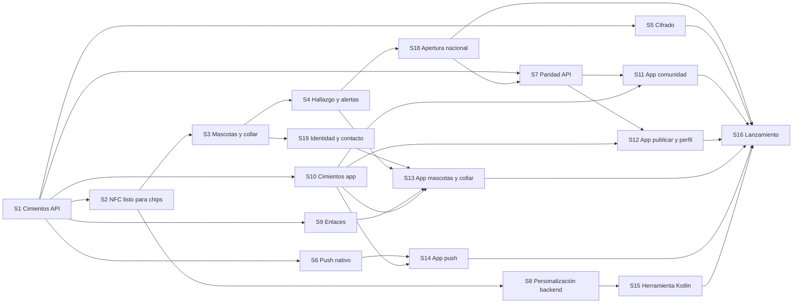

# 09 · Plan de trabajo por secciones

Cada sección se trabaja, revisa y cierra por separado. Una sección no se da por terminada
hasta cumplir su **criterio de aceptación** y la **definición de hecho** global. Los
identificadores `RF`, `RNF` y `SEG` remiten al documento 01.

## Definición de hecho (aplica a toda sección)

- Pruebas unitarias en verde; las de contrato o tokens también cuando apliquen.
- `lint` y `typecheck` sin errores en el repositorio tocado.
- Cero valores mágicos: todo parámetro nuevo aparece en la tabla del documento 01 y en
  un `constants.ts`.
- Sin secretos ni URLs en código; variables nuevas documentadas en `.env.example` y en el
  documento 08.
- Documentación de esta carpeta actualizada si la implementación cambió el diseño; si la
  decisión cambió, ADR nueva.
- Commit convencional en español, como en el repo web.

## Orden y dependencias

Orden recomendado de ejecución: **S1 → S2** (hito «listo para chips», antes de que
lleguen) → S10 → S3 → S4 → **S18 → S19 → S5** → S9 → S13 → S6 → S14 → S7 → S11 → S12 →
S8 → S15 → S16. S5 debe cerrarse antes de guardar cualquier dato de contacto nuevo y antes
de S16; hoy `FinderReport.contactPhone` se guarda en claro, por eso S5 va antes de cualquier
prueba con personas reales. S18 va antes de las pantallas de la app para que consuman el
contrato definitivo del feed.

---

## S0 · Repositorio móvil y documentación

**Repositorio:** este. **Estado:** documentación entregada; repositorio inicializado.

- [x] `git init`, `.gitignore`, `.editorconfig`, `README.md`.
- [x] Documentos 01 a 10 y ADR 001 a 011.
- [x] Remoto `origin` apuntando a github.com/CHEM00/Esperanza-Animal-Mobile.
- [ ] Renombrar el directorio local a `Esperanza-Animal-Mobile` (acción manual con la sesión cerrada: Windows bloquea la carpeta en uso).

**Aceptación:** la documentación describe todos los requisitos de la conversación y no
contradice el código del repo web.

---

## S1 · Backend: cimientos de la API v1

**Repositorio:** `esperanza-animal`. **Cubre:** RF-A2, RF-A3, RF-A5, RF-N3, RNF-6, RNF-8.
**Estado:** implementada el 2026-09-13 en la rama `feat/s1-cimientos-api-v1` (commit sin
subir). Pendiente de la prueba en vivo (abajo).

- [x] `lib/api/spec.ts` + `create-route-handler.ts` + `route-handler.ts`: declaración pura
      de rutas (`defineRouteSpec`) e implementación (`implementRoute`) con orden fijo:
      correlación, límite de tasa, política de acceso, validación Zod de params, query y
      body, servicio y validación de salida. Políticas `public`, `session`, `admin`;
      `scanToken` se agrega en S2.
- [x] `lib/api/problem.ts`: Problem Details con `code` estable y mapeo de `ZodError`.
- [x] `lib/api/rate-limit.ts`: puerto con adaptador en memoria y perfiles `standard` y
      `scan`.
- [x] Better Auth: plugin bearer; `trustedOrigins` con `MOBILE_APP_SCHEME`; client IDs
      móviles de Google y bundle id de iOS como audiencias del ID token
      (`buildSocialProviderConfig`).
- [x] `GET /api/v1/config` (feature `config`) y `GET /api/v1/me` (feature `account`).
- [x] Contrato: `lib/api/openapi.ts` genera OpenAPI 3.1 desde Zod sin dependencias nuevas
      (Docker no estaba disponible para regenerar el lockfile). `contract/openapi.json`
      es un snapshot de archivo de Vitest: `contract:build` lo reescribe con `--update`
      y `contract:check` (y `npm test`) fallan si difiere.
- [x] Variables `GOOGLE_MOBILE_CLIENT_IDS`, `IOS_BUNDLE_ID`, `MOBILE_APP_SCHEME` y
      `MIN_SUPPORTED_APP_VERSION` en `env-schema.ts`, `.env.example` y README.
- [x] Pruebas: 27 nuevas (handler, políticas, Problem Details, limitador, contexto,
      OpenAPI, contrato, configuración, `/me`, proveedores, entorno). 111 en total en
      verde; `typecheck`, `lint` y `next build` limpios.
- [ ] **Prueba en vivo pendiente:** requiere Postgres arriba (Docker) y un client ID
      móvil de Google real. Pasos: `docker compose up -d`, `npm run dev`,
      `GET /api/v1/config` sin sesión; después `POST /api/auth/sign-in/social` con
      `idToken` de Google, tomar `set-auth-token` y llamar `GET /api/v1/me` con
      `Authorization: Bearer`.

Desviaciones respecto al diseño, ya reflejadas en los documentos: `MAX_PUBLICATIONS_PER_DAY`
se movió a `features/publications/constants.ts` para que la configuración remota lo lea
sin importar el servicio; se agregó `API_RATE_LIMIT_STANDARD_PER_MINUTE`.

**Aceptación:** un script de prueba inicia sesión con un ID token de Google de prueba y
obtiene `GET /api/v1/me` con `Authorization: Bearer`; el contrato se genera y CI falla si
está desactualizado; la web sigue pasando `npm test` y `npm run build`.

---

## S2 · Backend: NFC listo para chips

**Repositorio:** `esperanza-animal`. **Cubre:** RF-E2, RF-E6, RF-F2, SEG-1, SEG-2, SEG-8,
SEG-10. **Hito:** M1 «listo para chips» (documento 10 §1).
**Estado:** implementada y probada en vivo el 2026-09-13 en la rama
`feat/s1-cimientos-api-v1` (mismo branch que S1). **Hito M1 alcanzado.**

- [x] `lib/nfc/`: AES-CMAC (RFC 4493), descifrado CBC de PICCData, parseo del bloque,
      llaves de sesión SV1 y SV2, CMAC truncado en tiempo constante, descifrado de datos de
      archivo, diversificación estilo AN10922 y llavero por versiones (`key-ring.ts`).
      Sin Prisma ni HTTP.
- [x] Pruebas: vectores de RFC 4493 §4 y los de AN12196 páginas 12 y 18 (con llaves de
      fábrica), más un vector con llaves propias, tomados de la implementación de
      referencia pública `icedevml/sdm-backend`. 31 pruebas en `lib/nfc`.
- [x] Migración `20260913082045_tags_and_scans`: `TagLot`, `Tag`, `Scan`, `ScanSession`,
      cinco enums y seis valores nuevos de `AdminActionType`. Sin columnas de mascota.
- [x] `features/tags`: tabla de transiciones explícita (`state-machine.ts`), constantes,
      consulta de versión de llaves por UID.
- [x] `features/scans`: `resolveNfcScan` (verifica, anti-replay atómico con `updateMany`
      sobre el contador, crea `Scan`, emite `ScanSession`), estrategia de vista por
      estado, proyección pública sin motivo de rechazo, `POST /api/v1/scans/nfc`.
- [x] Política `scanToken` en la capa de API (cabecera `x-scan-token`, esquema de
      seguridad propio en el contrato, códigos `scan.token_required` y
      `scan.token_invalid`), lista para los endpoints de S4.
- [x] Página `GET /t` con diagnóstico por `NFC_SCAN_DIAGNOSTICS` y redirección a
      `/collar`; página neutra `/collar`. Límite de tasa con el perfil `scan`.
- [x] `scripts/seed-tag-prueba.mjs <uid>`.
- [x] Variables `NFC_META_READ_KEY_V1`, `NFC_FILE_READ_MASTER_KEY_V1`,
      `NFC_APP_MASTER_KEY_V1`, `NFC_SYSTEM_IDENTIFIER`, `NFC_ALLOW_FACTORY_KEYS`,
      `NFC_SCAN_DIAGNOSTICS`; las banderas están prohibidas en producción por validación.

**Prueba en vivo realizada** (Docker con Postgres 16, `next dev`, tag del vector AN12196
p. 12 sembrado con llaves de fábrica): `/t` devolvió `VALIDO` con contador 61; la misma
URL de nuevo `REPLAY`; firma alterada `FIRMA_INVALIDA`; parámetros rotos
`FORMATO_INVALIDO`; los cuatro quedaron en la tabla `scan`; `POST /api/v1/scans/nfc`
respondió solo la vista neutra en todos los casos. La emisión del token (vista
`ACTIVATION`, que exige sesión) está cubierta por pruebas unitarias del resolvedor y por
el código del servicio, no por la prueba en vivo.

Desviaciones respecto al diseño, ya reflejadas en los documentos: la entrada de
diversificación es `UID || número de llave || identificador de sistema` (no hay AID en
el NTAG 424 DNA); la versión vigente de llaves se deriva de las variables presentes
(no existe `NFC_KEY_VERSION_CURRENT`); los hashes de IP y dispositivo usan una llave
derivada de `BETTER_AUTH_SECRET` con HKDF (no existe `HASH_SALT`).

**Aceptación:** una petición HTTP a `/t` con el vector público de llaves cero registra un
`Scan` `VALIDO` y muestra la página de diagnóstico; repetirla devuelve `REPLAY`; una
firma alterada devuelve `FIRMA_INVALIDA` con la misma respuesta externa; la lista del
documento 10 §1 está completa sin pendientes.

---

## S3 · Backend: mascotas, guardianes y collar

**Repositorio:** `esperanza-animal`. **Cubre:** RF-C1 a RF-C8, RF-D1 a RF-D4, RF-E3, RF-E4,
RF-E5 (desvincular), ADR-002, ADR-011.
**Estado:** implementada y probada en vivo el 2026-09-13 en la rama
`feat/s1-cimientos-api-v1`.

- [x] Migraciones `pets_and_guardians` (con los índices únicos parciales «un dueño por
      mascota» y «una asignación abierta por tag», añadidos a mano al SQL; Prisma no los
      detecta como drift) y `admin_actions_transfer_contact`.
- [x] `lib/photo-storage.ts` con ámbitos `user` y `pet` (`{UPLOADS_DIR}/pets/{petId}`),
      copia de fotos entre ámbitos y `lib/photo-scope-resolver.ts` como cadena de
      resolvedores para `/fotos/{id}`.
- [x] `features/pets`: esquemas (JSON y multipart), constantes, código público,
      máquina de estados, consultas, mapeadores y servicio: alta con fotos, edición
      parcial, baja lógica, fotos, modo perdido y regreso.
- [x] `features/publications`: `createPublicationFromPet` dentro de la transacción del
      modo perdido y `hasReachedDailyPublicationLimit` compartido.
- [x] `features/guardians`: invitaciones y transferencias con código opaco (solo el hash
      en la base), aceptación, cancelación por mascota y resolución administrativa con
      bitácora (`RESOLVER_TRANSFERENCIA`; el endpoint llega en S8).
- [x] `features/tags`: activación con token de escaneo de un solo uso, desvinculación y
      `TagAssignment`; el escaneo ya reconoce al guardián de la mascota del tag.
- [x] Capa de API: cuerpos `multipart/form-data` con validación de archivos en cantidad,
      peso y tipo, documentados en el contrato; 16 códigos de problema nuevos.
- [x] 19 rutas nuevas bajo `/api/v1` (mascotas, fotos, modo perdido, guardianes,
      invitaciones, transferencias, collar). Contrato: 18 rutas, 15 componentes.
- [x] `scripts/dev-session.mjs`: sesión portadora de prueba sin OAuth (solo desarrollo).
- [x] Al eliminar la cuenta, las mascotas del dueño quedan inactivas y sus collares libres.
- [x] Pruebas: esquemas, código público, máquina de estados; 168 en total en verde;
      typecheck, lint y `next build` limpios.

**Prueba en vivo realizada** (22 comprobaciones): crear mascota con foto por multipart,
listar, escaneo con sesión sobre tag `LISTO` → `ACTIVATION` con token, activar collar,
token de un solo uso, invitación y aceptación por un segundo usuario, invitación de un
solo uso, un guardián no edita, escaneo del guardián → `GUARDIAN`, escaneo anónimo →
`FINDER`, modo perdido por el guardián crea el caso `ACTIVA` enlazado con copia de la
foto, no se activa dos veces, regreso cierra el caso como `ENCONTRADA`, desvincular deja
el tag `LISTO` con la asignación cerrada, la foto se sirve como WebP.

Desviaciones respecto al diseño, ya reflejadas en los documentos: los eventos de dominio
se difieren a S4 (aquí las operaciones transaccionales son llamadas directas y las
alertas usan los servicios existentes); cancelar una transferencia es
`POST /pets/{id}/transfers/cancel` (evita dos nombres de parámetro dinámico bajo la misma
carpeta de rutas); al aceptar una transferencia el dueño anterior queda como `GUARDIAN`;
`hasNfcTag` en el resumen del feed llega con la API del feed (S7).

**Aceptación:** flujo completo por API en una prueba de integración local: crear mascota
con fotos, invitar guardián, aceptar, activar tag `LISTO` con un token de escaneo válido,
activar modo perdido y verificar que existe un caso `ACTIVA` enlazado; desvincular
devuelve el tag a `LISTO` y cierra la asignación.

---

## S4 · Backend: hallazgo, alertas y páginas web del flujo

**Repositorio:** `esperanza-animal`. **Cubre:** RF-E5 (silencio, historial), RF-E7, RF-F3 a
RF-F6, RF-F8 a RF-F10, RF-I2, RF-I7, RF-I8, SEG-6, SEG-7, ADR-008, ADR-010.
**Estado:** implementada y probada en vivo el 2026-09-24 (commit en `main`).

- [x] Migraciones `finder_reports_and_alert_zone` (`FinderReport`; tipos de alerta
      `AVISO_HALLAZGO`, `ESCANEO_COLLAR`, `CASO_CERCANO`, `TRANSFERENCIA_MASCOTA`; zona de
      alertas en el perfil) y `scan_session_optional_tag` (el camino QR abre sesiones sin
      collar).
- [x] `features/finder`: estrategias por nivel de confianza (`trust-levels.ts`), cadena de
      políticas (`policies.ts`: sesión usable, vista finder, mascota disponible, tag en
      revisión, silencio, cooldown, tope diario), aviso con foto y ubicación redondeada,
      historial de escaneos paginado, vista previa pública y marcado de sospecha.
- [x] `features/domain-events.ts` + `lib/events/bus.ts`: bus de eventos de dominio
      (diferido desde S3); las alertas son suscriptores que nunca tumban la acción.
- [x] `features/alerts`: alertas del collar con agrupación por ventana, prioridad y texto
      según el estado de la mascota (`collar-messages.ts`); casos cercanos por radio
      (`lib/geo.ts`: Haversine sobre caja envolvente; un push por cubeta de distancia).
- [x] Rutas: `POST /api/v1/scans/qr`, `GET /api/v1/scans/{token}`,
      `POST /api/v1/scans/{token}/finder-report`, `GET /pets/{id}/scans`,
      `GET /pets/{id}/public-preview`, `POST /pets/{id}/scans/{scanId}/suspicious`,
      `POST /tags/{id}/mute`, `DELETE /tags/{id}/mute`.
- [x] Páginas `/encontre/{token}` (sin sesión ni navegación; distingue sesión vencida de
      consumida) y `/q/{code}`; `/t` redirige a `/encontre` con lectura válida.
- [x] Zona de alertas (RF-I8) en onboarding y ajustes: punto obligatorio redondeado y radio
      de `ALERT_RADIUS_OPTIONS_KM`; el punto del mapa pasa a ser obligatorio en
      publicaciones y avistamientos (`features/map/schemas.ts`).
- [x] Pruebas de políticas (cada rechazo), estrategias, cubetas, mensajes, geometría y
      bus; 196 en total en verde; `typecheck`, `lint` y `next build` limpios.

**Prueba en vivo realizada** (2026-09-24, Docker con Postgres 16, `next dev`, tag de
fábrica y URLs SUN generadas con la misma criptografía del vector AN12196; 29
comprobaciones): activación con token de un solo uso; escaneo anónimo → `FINDER` con alerta
`ESCANEO_COLLAR` a los dos guardianes; `/encontre/{token}` sin sesión muestra a la mascota;
aviso con ubicación, foto y teléfono → `FinderReport` con coordenadas a 3 decimales y
alerta `AVISO_HALLAZGO` a cada guardián; reuso del token → `scan.token_invalid`; segundo
aviso del mismo dispositivo → `scan.cooldown`; QR → `QR_SIN_VERIFICAR` sin teléfono del
finder ni del dueño, con alerta; `/q/{code}` redirige a `/encontre`; collar silenciado →
sin alerta de escaneo y `scan.muted`; historial con el aviso; sospecha → tag
`EN_REVISION`, aviso `SOSPECHOSO`, y NFC y QR posteriores en vista neutra.

Desviaciones respecto al diseño, ya reflejadas en los documentos: quitar el silencio es
`DELETE /tags/{id}/mute` (no `POST …/unmute`); `ScanSession.tagId` es opcional para el QR
de una mascota sin collar; el cooldown reconoce al dispositivo por `x-device-id` **o** por
IP, así que dos finders distintos detrás de la misma NAT de operadora pueden chocar dentro
de la ventana (riesgo aceptado, documento 02 §9); la zona de alertas (RF-I8) se agregó aquí
porque el push de cercanía la necesita; `activateTag` exige explícitamente una sesión con
tag (corrección de tipos al cerrar la sección).

**Aceptación:** cumplida (ver prueba en vivo).

---

## S5 · Backend: cifrado por campo

**Repositorio:** `esperanza-animal`. **Cubre:** RF-B2, RF-B4, RF-K4 (parcial), SEG-4, SEG-5,
ADR-004. **Estado:** implementada y probada en vivo el 2026-09-25 (commit en `main`).

- [x] `lib/crypto/` con clases y puerto: `KeyProvider` (interfaz) y `EnvKeyProvider`
      (ranuras `DATA_ENCRYPTION_MASTER_KEY_V1..V9`, vigente la más alta salvo
      `DATA_ENCRYPTION_KEY_VERSION_CURRENT`), `FieldCipher` (sobre AES-256-GCM, formato
      `ea1`; la versión va como dato autenticado del envoltorio de la DEK y el valor lleva
      un AAD sin versión para que la rotación no lo recifre), `BlindIndex` (HMAC por HKDF de
      la maestra vigente; `candidates` para buscar durante una rotación) y `ContactSealer`
      (fachada que reúne cifrado e índice; `open` acepta el heredado en claro durante el
      relleno). Reutiliza `lib/hashing.ts` (HKDF) del rate limit.
- [x] Migración `encrypted_contact_fields`: `UserProfile.contactPhoneEnc/Hmac`,
      `altPhoneEnc`, `emergencyNameEnc`, `emergencyPhoneEnc`; `Publication.phone` pasa a
      opcional y se agregan `phoneEnc` y `phoneHmac` (índice); `FinderReport.contactPhoneEnc`;
      `AdminActionType.ROTAR_CIFRADO`.
- [x] Relleno idempotente al arrancar (`sealLegacyContacts` en `instrumentation.ts`): los
      teléfonos heredados en claro se cifran y el texto en claro se pone a NULL. La columna
      `phone` se elimina en una migración posterior, cuando producción haya arrancado con S5.
- [x] Escritura y lectura: publicar, editar y modo perdido guardan `phoneEnc/phoneHmac`;
      `getPublicationContactPhone` descifra para el número oculto, el cartel y la edición;
      el aviso del finder guarda `contactPhoneEnc` y se descifra en /alertas y en el
      historial de escaneos; la vista de finder usa el **teléfono del perfil de contacto del
      dueño** (RF-C7) y cae al del caso activo.
- [x] `PUT /api/v1/me/contact` (reemplazo completo; `profile.incomplete` sin onboarding) y
      `contact` dentro de `profile` en `GET /api/v1/me`.
- [x] Rotación por lotes: `POST /api/v1/internal/crypto/rewrap` (rol admin, bitácora
      `ROTAR_CIFRADO`): reenvuelve la DEK con la maestra vigente y recalcula índices hasta
      `remaining = 0`.
- [x] Entorno: `DATA_ENCRYPTION_MASTER_KEY_V1` obligatoria (validada al arrancar); dummy en la
      etapa de build del Dockerfile; `.env.example` con el procedimiento de rotación.
- [x] Pruebas: 239 en verde (ida y vuelta, manipulación del valor, del envoltorio y de la
      versión, versión sin llave, rotación sin recifrar, índice determinista y candidatos,
      transición del heredado, entorno); `typecheck`, `lint` y `next build` limpios.

**Prueba en vivo realizada** (2026-09-25, 16 + 5 comprobaciones): una publicación sembrada
con teléfono en claro queda cifrada al arrancar (5 publicaciones y 2 avisos heredados de
pruebas anteriores) y su cartel la descifra; un caso nuevo guarda `ea1.1.` sin texto en
claro; detalle enmascarado, cartel y edición descifran; `PUT /me/contact` normaliza y
guarda solo campos `ea1` e índice; `GET /me` devuelve el contacto; `/encontre` usa el
teléfono del perfil con la mascota en casa; el teléfono del finder viaja cifrado y se lee
en /alertas y en el historial; cero teléfonos en claro en la base; rewrap sin llave nueva no
hace nada y sin rol responde 404. Con `V2` en el entorno y el servidor reiniciado: la
rotación termina con `remaining = 0`, todas las publicaciones quedan en `ea1.2.`, la
bitácora registra la rotación y el cartel y el contacto siguen legibles.

Desviaciones respecto al diseño, ya reflejadas en los documentos: la bitácora
`DESCIFRAR_CONTACTO` (RF-K4) espera a S8, porque hoy ninguna pantalla de administración
lee teléfonos; la rotación es un endpoint interno por lotes y no un script, porque el
cifrador vive en TypeScript del backend; el índice ciego se deriva de la maestra vigente y
la rotación lo recalcula (durante una rotación se busca con `candidates`).

**Aceptación:** cumplida (ver prueba en vivo).

---

## S6 · Backend: dispositivos y push nativo

**Repositorio:** `esperanza-animal`. **Cubre:** RF-I3, RF-I4, RF-M3, ADR-009.

- [ ] Migración `devices`; `features/devices` con `PUT` y `DELETE`.
- [ ] `lib/notifications`: puerto `NotificationChannel`; adaptadores Web Push (reescritura
      del servicio actual sobre el puerto), FCM y APNs; mapeo `AlertType` a canal,
      prioridad y URL de destino.
- [ ] Limpieza de tokens no registrados y de dispositivos inactivos en `runRetention()`.
- [ ] Pruebas con dobles de proveedor: enrutamiento por plataforma, limpieza, payload.

**Aceptación:** una alerta creada por el servicio existente llega a un dispositivo Android
y a uno iOS registrados en el entorno de pruebas, con el canal y la prioridad correctos, y
al tocarla la URL de destino es la esperada; la web sigue recibiendo Web Push.

---

## S7 · Backend: paridad de API para la app

**Repositorio:** `esperanza-animal`. **Cubre:** RF-A6, RF-A7, RF-G1 a RF-G6, RF-H1, RF-H2,
RF-I5, RF-I6, RF-J1 a RF-J5, RF-K1, RF-M2.

- [ ] `routes.ts` en `feed`, `publications`, `sightings`, `reports`, `alerts`,
      `onboarding`, `profile`, `colonias`, `account`, `map`, delegando a los servicios
      existentes.
- [ ] Paginación por cursor en feed y alertas (la web conserva su comportamiento).
- [ ] Mapa: consulta por área visible, agrupación en servidor, capa de escaneos para
      guardianes, rastro por caso.
- [ ] `runRetention()` junto a `runLifecycle()` en `instrumentation.ts`.
- [ ] Pruebas por endpoint sobre los esquemas y las reglas ya cubiertas por las actions.

**Aceptación:** cada regla de producto del documento 01 §5 con origen `web` se comporta
igual por API que por Server Action, verificado con una prueba por regla (límite diario,
fotos, colonia seleccionable, un avistamiento por día, número oculto con sesión).

---

## S8 · Backend: personalización y administración de tags

**Repositorio:** `esperanza-animal`. **Cubre:** RF-E1, RF-K2, RF-L2, SEG-3.

- [ ] Endpoints internos: lotes, llaves derivadas, `provisioned`, revocar, resolver
      revisión; todos con rol `admin` y bitácora.
- [ ] Páginas de administración: lotes, tags por estado, cola de revisión, transferencias
      pendientes.
- [ ] Pruebas: derivación por UID reproducible, `provisioned` rechaza lecturas que no
      verifican, transiciones inválidas rechazadas.

**Aceptación:** un administrador da de alta un lote, obtiene llaves para un UID y, con
una lectura válida generada en prueba, el tag pasa a `LISTO`; la bitácora registra ambas
acciones con operador y motivo.

---

## S9 · Backend: enlaces y archivos de asociación

**Repositorio:** `esperanza-animal`. **Cubre:** RF-N2, RF-N4.
**Estado:** implementada y probada en vivo el 2026-09-25 (commit en `main`). La validación
con los verificadores públicos de Apple y Google queda para cuando existan los
identificadores reales en el despliegue (ver abajo).

- [x] `lib/deep-links.ts`: lista canónica de rutas que abren la app (`/t`, `/q/*`,
      `/encontre/*`, `/publicacion/*`, `/invitacion/*`, `/transferencia/*`), exclusión del
      cartel (`/publicacion/*/cartel` se imprime en el navegador), constructores de los dos
      archivos y `isDeepLinkPath` para validar retornos. `config/deep-link-paths.json` de
      la app coincide con ella (comprobado a mano; la app debe mandar el cartel al
      navegador en Android, que no tiene exclusiones).
- [x] `/.well-known/apple-app-site-association` con `applinks` (appID
      `APPLE_TEAM_ID.IOS_BUNDLE_ID`, exclusiones primero) y content-type JSON; 404 sin
      variables.
- [x] `assetlinks.json` sobre `ANDROID_PACKAGE_NAME` y `ANDROID_CERT_SHA256` (validadas:
      id de paquete y huellas «AA:BB:…» separadas por coma); `TWA_*` siguen valiendo como
      alias resueltos en la validación de entorno, así el despliegue actual no cambia.
- [x] Respaldo web de los enlaces (RF-N4): páginas `/invitacion/{code}` y
      `/transferencia/{code}` que explican el enlace, mandan al login con retorno
      (`/login?volver=…`, solo rutas de la app: sin redirecciones abiertas) y aceptan con la
      sesión usando los mismos servicios que la API; estados usado, vencido e inválido.
- [x] Pruebas: 248 en verde (rutas y exclusiones, AASA, assetlinks, huellas, retorno del
      login, alias y validación de entorno); `typecheck`, `lint` y `next build` limpios.

**Prueba en vivo realizada** (2026-09-25, 12 comprobaciones, servidor con identificadores de
prueba y alias `TWA_*`): el archivo de Apple responde JSON con el appID, la exclusión del
cartel primero y las seis rutas; `assetlinks.json` sigue publicándose con los alias; la
invitación creada por API apunta a `/invitacion/{code}`; sin sesión la página explica y
manda al login con retorno, el login lleva el retorno como `callbackURL` y un retorno
externo se ignora; con sesión ofrece aceptar; tras aceptar el enlace aparece como usado; un
código inexistente muestra «Enlace no válido»; la transferencia se comporta igual.

**Pendiente en el despliegue (no es código):** en Coolify, `ANDROID_*` puede sustituir a
`TWA_*` cuando se quiera (no es obligatorio); `APPLE_TEAM_ID` e `IOS_BUNDLE_ID` llegan con
la cuenta de Apple Developer. Verificar entonces con
`https://app-site-association.cdn-apple.com/a/v1/alakito.mx` y
`digitalassetlinks.googleapis.com/v1/statements:list?source.web.site=https://alakito.mx&relation=delegate_permission/common.handle_all_urls`.

**Aceptación:** cumplida en local; la de los validadores públicos, al desplegar con
identificadores reales.

---

## S10 · Móvil: cimientos

**Repositorio:** este. **Cubre:** RF-A1 a RF-A5, RF-N3, RNF-5, RNF-8, RNF-9.
**Estado:** código implementado y verificado en local el 2026-09-13 (typecheck, lint,
35 pruebas, evaluación de `app.config.ts` y bundle de Android). Pendiente lo que exige
cuentas y dispositivos (abajo).

- [x] Proyecto Expo SDK 57 con TypeScript estricto, ESLint con reglas de capas
      (`eslint.config.js`), estructura del documento 06 §2.
- [x] `core/config` validado al arrancar (`parseAppConfig`); `app.config.ts` con la
      identidad publicada de `config/app-identity.js` y el entorno de build de
      `config/build-config.js` (evaluable con el entorno vacío, como hace EAS); `eas.json`
      con perfiles `development`, `preview`, `production`.
- [x] `contract:pull` (copia versionada con `contract.lock.json`), `api:generate` y
      `api:check`; cliente `openapi-fetch` con correlación, dispositivo y token portador;
      Problem Details a `ApiError` y textos por código.
- [x] `tokens:sync` y `tokens:check` desde `tokens.css` y `globals.css` de la web; tema
      claro y oscuro con Quicksand, Space Grotesk e Inter empaquetadas.
- [x] Navegación: pestañas nativas, pila nativa, `core/navigation/links.ts` con la misma
      fuente de rutas que los intent filters y los applinks (`config/deep-link-paths.json`).
- [x] Autenticación: Google nativo y Apple nativo con ID token, sesión en almacenamiento
      seguro, cierre de sesión que limpia local aunque el servidor falle.
- [ ] Microsoft por navegador del sistema: requiere el plugin Expo de Better Auth en el
      backend (documento 06, notas de S10).
- [ ] `401` global: se resuelve en S11 junto con la primera pantalla que lo necesite.
- [x] Configuración remota como primer request, pantalla de reintento sin red y
      actualización obligatoria (M11).
- [x] Pestaña Perfil mínima que ejercita el ciclo completo: entrar, `GET /api/v1/me` con
      token portador, salir.
- [x] CI en GitHub Actions: lint, typecheck, pruebas, `api:check`, `tokens:check`,
      evaluación de la configuración de Expo.
- [x] Proyecto EAS `@sysosa/alakito` creado el 2026-09-25 (`eas init`); el id vive en
      `config/app-identity.js` porque EAS no carga `.env` al evaluar la configuración.
- [ ] **Pendiente de cuentas y dispositivos:** client IDs de Google de tipo Android e iOS, cuenta de Apple para
      Sign in with Apple, y la primera build de desarrollo instalada en un Android y en
      el iPhone. Sin SDK de Android en la máquina, la build local no es posible.

**Aceptación:** la app arranca en ambos dispositivos, inicia sesión con Google y Apple
contra el entorno de pruebas, muestra `GET /api/v1/me` y CI está en verde.

---

## S11 · Móvil: comunidad (feed, detalle, mapa, alertas)

**Repositorio:** este. **Cubre:** RF-G1 a RF-G3, RF-G6, RF-H1, RF-H2, RF-I5, RF-I6, RF-J1 a
RF-J5, RF-K1.

- [ ] Feed 2a/4c/4e con pestañas nativas, filtro de especie y paginación infinita.
- [ ] Detalle 4a/6g: galería, badge, contacto con relevo y revelado, avistamientos,
      mini mapa, compartir nativo, reportar 6a.
- [ ] Hoja 3f con selector de pin y zona aproximada.
- [ ] Mapa 5a: pines por tipo, clústeres, rastro, filtros, tarjeta inferior.
- [ ] Alertas 4d con punto de no leídas.
- [ ] Flujos Maestro: navegar feed, abrir detalle, avistar, reportar.

**Aceptación:** paridad visual con la web en ambos temas revisada pantalla por pantalla;
flujos Maestro en verde sobre la build `preview` en Android.

---

## S12 · Móvil: publicar y perfil

**Repositorio:** este. **Cubre:** RF-A6, RF-A7, RF-B1, RF-B2, RF-G4, RF-G5.

- [ ] Onboarding 6b con búsqueda por CP.
- [ ] Publicar 3d → 3c → 3e como máquina de estados; fotos con compresión; editar 6c;
      eliminar; encontrado 5c y revertir; reactivar.
- [ ] Perfil 3g: stats, mis casos, casos en los que ayudaste.
- [ ] Ajustes: tema, alertas de colonia, contacto del dueño (M12), privacidad, eliminar
      cuenta.
- [ ] Flujos Maestro: onboarding, publicar, marcar encontrado.

**Aceptación:** una publicación creada desde la app aparece en la web con las mismas
fotos y datos; los límites del servidor se reflejan en la app antes de enviar.

---

## S13 · Móvil: mascotas y collar

**Repositorio:** este. **Cubre:** RF-C1 a RF-C8, RF-D1 a RF-D4, RF-E3, RF-E5, RF-F1, RF-F2,
RF-F6 a RF-F9.

- [ ] M1, M2, M3 con fotos y preferencias de visibilidad.
- [ ] M10 modo perdido reutilizando los avisos 3d y 3e.
- [ ] M8 guardianes, M9 invitaciones y transferencias por enlace.
- [ ] Resolución de escaneo por enlace universal: estrategias `GUARDIAN`, `FINDER`,
      `ACTIVATION`, `NEUTRAL`; M6 vista de finder en la app.
- [ ] M4 activación con máquina de estados; M5 lectura en primer plano y respaldo por QR
      con cámara.
- [ ] M7 historial con mapa, marcar sospechoso; silenciar y desvincular.
- [ ] Flujos Maestro con URL de escaneo simulada (deep link) para activación y hallazgo.

**Aceptación:** con un tag `LISTO` en el entorno de pruebas, el dueño activa el collar
desde el iPhone y desde Android acercando el teléfono; al acercarlo de nuevo abre el
perfil; un tercer teléfono sin app abre la vista de finder en el navegador y el aviso
llega como notificación al dueño.

---

## S14 · Móvil: notificaciones push

**Repositorio:** este. **Cubre:** RF-I3, RF-I4.

- [ ] Permiso en contexto; registro y baja de dispositivo; canales de Android.
- [ ] Toque de notificación resuelto por el mapa de enlaces; manejo en primer plano con
      invalidación de consultas.
- [ ] Matriz de prueba manual por tipo de alerta y plataforma.

**Aceptación:** cada tipo de alerta abre la pantalla correcta en ambas plataformas desde
segundo plano, primer plano y app cerrada.

---

## S15 · Herramienta de personalización

**Repositorio:** `esperanza-animal`, carpeta `tools/personalizador/` (ADR-012).
**Cubre:** RF-L1 a RF-L3, SEG-3. Decidido el 2026-09-24: escritorio con el lector ACR122U
que ya existe, sin TapLinx.

- [ ] Paquete Node propio (fuera del `Dockerfile` de la web) con `nfc-pcsc` sobre el
      ACR122U; reutiliza `src/lib/nfc` (AES-CMAC, diversificación, SUN) sin duplicarlo.
- [ ] Comandos del NTAG 424 DNA como APDU ISO 7816-4, en módulos puros probados con los
      vectores de AN12196: `GetVersion`, `Read_Sig` (firma de originalidad NXP),
      `AuthenticateEV2First` con mensajería segura, `ChangeKey` (0 a 4),
      `ChangeFileSettings` con SDM (PICCData cifrado + CMAC; desplazamientos calculados
      desde la plantilla que entrega el backend), `WriteData` del NDEF.
- [ ] Sesión de administrador (token portador) contra los endpoints internos de S8; alta
      de lote; personalización paso a paso con confirmación por chip; reintento con la
      `keyVersion` emitida si el cambio de llaves quedó a medias; diagnóstico.
- [ ] Guía de instalación del driver ACS en Windows en el documento 08.
- [ ] Pruebas unitarias de tramas, desplazamientos y secuencias; QA manual con el
      documento 10 §5 usando los 5 tags de prueba.

**Aceptación:** un chip de fábrica queda `LISTO` en el entorno de pruebas con el ACR122U,
un teléfono abre `/encontre` al acercarlo y TagWriter ya no puede reconfigurarlo.

---

## S16 · Lanzamiento

**Repositorios:** ambos. **Cubre:** RF-N1, LEG.

- [ ] Aviso de privacidad actualizado: escaneo, ubicación aproximada del finder,
      retención, contacto cifrado; consentimiento en la vista de finder.
- [ ] Play: la solicitud de producción del TWA fue **denegada** en septiembre de 2026 («más
      pruebas y más uso»). Cada rechazo abre otra ventana de 14 días sin apelación: mantener
      a los 12 testers instalados desde Play con 2 o 3 sesiones reales por semana, anotar
      qué probaron y qué se cambió, y volver a solicitar con esos datos. La app nativa entra
      como versión nueva del mismo paquete, así que el acceso a producción se hereda.
- [ ] Play: release de la app nativa sobre el paquete del TWA, formulario de seguridad de
      datos, capturas.
- [ ] App Store: TestFlight, notas para revisión (uso de NFC, Sign in with Apple),
      capturas.
- [ ] Monitoreo de errores en app y backend sin datos personales; runbook de rotación de
      llaves y de revocación de lote.
- [ ] Textos de venta del collar: qué hace y qué no (no rastrea).

**Aceptación:** ambas tiendas aprobadas; un usuario real completa: instalar, iniciar
sesión, registrar mascota, activar collar, recibir un aviso de hallazgo.

---

## S18 · Backend y web: apertura nacional

**Repositorio:** `esperanza-animal`. **Cubre:** RF-O1 a RF-O5 (documento 01 §2.O).
**Estado:** implementada y probada en vivo el 2026-09-25 (commit en `main`).

- [x] Migración `municipios_nacionales`: `active = true` en todo el catálogo y como valor
      por defecto; columnas `Municipio.lat/lng`; índice `(lat, lng)` en publicaciones;
      valores `DESACTIVAR_MUNICIPIO` y `REACTIVAR_MUNICIPIO` de la bitácora. Migración
      `unaccent_extension` (`CREATE EXTENSION IF NOT EXISTS unaccent`).
- [x] `scripts/inegi-a-centroides.mjs`: cabecera municipal por municipio desde el
      **servicio web** del Catálogo Único del INEGI (2,478 de 2,478, sin shapefiles) en
      `prisma/data/municipios-centroides.psv.gz`; `seed-catalogo.mjs` los aplica con un
      `UPDATE … FROM unnest()` que solo rellena municipios sin punto.
- [x] `features/map/constants.ts`: `COORDINATE_BOUNDS` = caja de México, `NATIONAL_VIEW`;
      `CITY_CENTER` eliminado. `LocationPicker` recibe `focus` y `MapCanvas` un
      `captureZoom`; el onboarding recentra el mapa al teclear el CP
      (`ColoniaPicker.onMunicipioLocated`), publicar arranca en la zona de alertas y
      «Lo vi» en el punto de pérdida.
- [x] `features/cities`: cookie `ea-ciudad` (un año, solo id de municipio), página
      `/ciudad` (búsqueda sin acentos con `unaccent`, GPS → municipio más cercano dentro
      de `NEAREST_CITY_MAX_KM`, «Mi ciudad», «Ver todo México»), acciones y pruebas.
- [x] `features/feed/scope.ts` (`resolveFeedScope`: elección > perfil > nada) y
      `map-focus.ts`; «Recientes» y «Encontrados» acotados al municipio; «Cerca de ti»
      por radio (caja envolvente + Haversine, tarjeta con distancia; perfiles sin zona
      siguen por colonia); pins del mapa acotados; chip de ciudad en el encabezado y en
      el mapa.
- [x] Marca: `REGION_NAME` = «México»; tagline y aviso de privacidad nacionales.
- [x] `GET /api/v1/config`: sin `activeMunicipios`; `map.nationalView` en vez de
      `cityCenter`. Contrato y cliente móvil regenerados.
- [x] Administración: `/admin/municipios` (pausar y reactivar con motivo y bitácora;
      lista de pausados y búsqueda sin acentos) y búsqueda por municipio en
      publicaciones.
- [x] Pruebas: 213 en verde (cookie, rutas de retorno, foco del mapa, radio, caja de
      México, escape de LIKE); `typecheck`, `lint` y `next build` limpios.

**Prueba en vivo realizada** (2026-09-25, 21 comprobaciones): persona de Monterrey con
zona de alertas y un caso publicado; el feed nacional lo muestra; con cookie de Monterrey
lo muestra y con cookie de Coatzacoalcos no; una cookie corrupta se ignora; mapa centrado
en la cabecera de Monterrey y vista nacional sin ciudad; `/ciudad?q=merida` encuentra
Mérida; con sesión el feed usa el municipio del perfil, «Cerca de ti» muestra el caso «a
menos de 1 km», la ciudad elegida manda sobre la del perfil y `/publicar` arranca en la
zona de alertas; municipio en pausa: lo publicado sigue visible y sus CP dejan de ser
seleccionables; `/api/v1/config` expone `nationalView`.

Desviaciones respecto al diseño, ya reflejadas en los documentos: el punto por municipio
es la **cabecera municipal** (INEGI), no el centroide geométrico, porque centra el mapa en
la mancha urbana; la ciudad elegida por cookie manda sobre la del perfil (explorar otra
ciudad sin tocar el perfil); la pausa no borra nada, solo bloquea CP nuevos. Deuda
consciente: el filtro por municipio del feed va por join `colonia.municipioId` (sin
desnormalizar) y el mapa nacional sin ciudad trae todos los pins; ambas se revisan en S7
con la consulta por área visible.

**Aceptación:** cumplida (ver prueba en vivo).

---

## S19 · Backend: identidad de la mascota y contacto del finder

**Repositorio:** `esperanza-animal`. **Cubre:** RF-C9, RF-C10, RF-F11 (ADR-013).
**Estado:** implementada y probada en vivo el 2026-09-25 (commit en `main`).

- [x] Migración `pet_change_log`: modelo `PetChangeLog` (campo, valor anterior y nuevo como
      texto recortado a `CHANGE_VALUE_MAX_LENGTH`; `changedById` sin FK), enum
      `PetChangeField`, `AlertType.PERFIL_MASCOTA` y `AdminActionType.CORREGIR_MICROCHIP`.
- [x] `features/pets/microchip.ts`: `decideMicrochipChange` (primera captura permitida;
      cualquier cambio posterior responde `pet.microchip_locked`, 409).
- [x] `features/pets/change-log.ts`: `diffPetPatch` (una entrada por campo que cambia de
      verdad; especie y detalle juntos), cambios de fotos (conteo antes y después; reordenar
      solo se registra) y `alertableFields` (nombre, microchip y fotos).
- [x] `updatePet`, `addPetPhotos`, `removePetPhoto` y `reorderPetPhotos` escriben el
      historial en la misma transacción; evento `pet.profile-changed` → alerta
      `PERFIL_MASCOTA` y push a los demás guardianes (nunca a quien editó).
- [x] `GET /api/v1/pets/{id}/changes?cursor&limit` (cualquier guardián; nombre de quien
      cambió o null si la cuenta ya no existe) y `PUT /api/v1/pets/{id}/microchip` (rol
      `admin`, motivo; bitácora `CORREGIR_MICROCHIP`, historial y alerta; `null` quita un
      microchip capturado por error).
- [x] `lib/contact-links.ts` (`whatsappUrl`, `telUrl`, lada `+52`) y `ContactButtons` en la
      tarjeta pública y en la confirmación del aviso; el detalle del caso usa el mismo helper.
- [x] Fila «Cambió el perfil de …» en `/alertas`. Contrato y cliente móvil regenerados.
- [x] Pruebas: 224 en verde (decisión del microchip, diff del historial, fotos, campos que
      alertan, enlaces de contacto); `typecheck`, `lint` y `next build` limpios.

**Prueba en vivo realizada** (2026-09-25, 20 comprobaciones): PATCH del microchip → 409
`pet.microchip_locked`; el mismo valor no es cambio; editar nombre y descripción deja dos
entradas con quién las hizo y alerta al guardián, no al dueño; agregar foto registra «1 foto →
2 fotos» y alerta; paginación por cursor; quien no es guardián recibe 404; `PUT /microchip`
sin rol → 404 y con admin → bitácora, historial y alerta al dueño; primera captura en una
mascota sin microchip → 200 con entrada null → valor; `/alertas` del guardián muestra la
fila; `/encontre` de una mascota perdida con opt-in muestra WhatsApp y Llamar con `+52`, el
aviso devuelve el teléfono y por QR no hay botones.

Desviaciones respecto al diseño, ya reflejadas en los documentos: la corrección
administrativa vive en la API (`PUT /pets/{id}/microchip`, rol admin) y no en una página del
panel, porque las páginas de mascotas de administración llegan con S8; los valores del
historial se guardan como texto legible y recortado, no como JSON: es un resumen para
guardianes, no un respaldo.

**Aceptación:** cumplida (ver prueba en vivo).

---

## S17 · Fase posterior (requiere macOS)

App Clip, Live Activities, widgets, chat efímero, SMS de respaldo. Se planifican cuando
S16 esté cerrado y exista entorno macOS.
