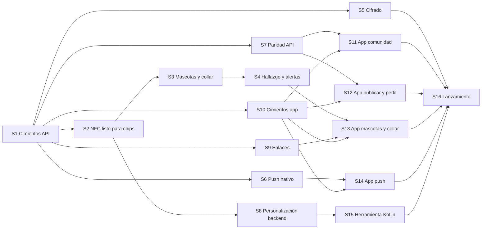

# 09 · Plan de trabajo por secciones

Cada sección se trabaja, revisa y cierra por separado. Una sección no se da por terminada
hasta cumplir su **criterio de aceptación** y la **definición de hecho** global. Los
identificadores `RF`, `RNF` y `SEG` remiten al documento 01.

## Definición de hecho (aplica a toda sección)

- Pruebas unitarias en verde; las de contrato o tokens también cuando apliquen.
- `lint` y `typecheck` sin errores en el repositorio tocado.
- Cero valores mágicos: todo parámetro nuevo aparece en la tabla del documento 01 y en
  un `constants.ts`.
- Sin secretos ni URLs en código; variables nuevas documentadas en `.env.example` y en el
  documento 08.
- Documentación de esta carpeta actualizada si la implementación cambió el diseño; si la
  decisión cambió, ADR nueva.
- Commit convencional en español, como en el repo web.

## Orden y dependencias

Orden recomendado de ejecución: **S1 → S2** (hito «listo para chips», antes de que
lleguen) → S10 → S3 → S4 → S9 → S13 → S6 → S14 → S7 → S11 → S12 → S5 → S8 → S15 → S16.
S5 debe cerrarse antes de guardar cualquier dato de contacto nuevo y antes de S16.

---

## S0 · Repositorio móvil y documentación

**Repositorio:** este. **Estado:** documentación entregada; repositorio inicializado.

- [x] `git init`, `.gitignore`, `.editorconfig`, `README.md`.
- [x] Documentos 01 a 10 y ADR 001 a 011.
- [x] Remoto `origin` apuntando a github.com/CHEM00/Esperanza-Animal-Mobile.
- [ ] Renombrar el directorio local a `Esperanza-Animal-Mobile` (acción manual con la sesión cerrada: Windows bloquea la carpeta en uso).

**Aceptación:** la documentación describe todos los requisitos de la conversación y no
contradice el código del repo web.

---

## S1 · Backend: cimientos de la API v1

**Repositorio:** `esperanza-animal`. **Cubre:** RF-A2, RF-A3, RF-A5, RF-N3, RNF-6, RNF-8.
**Estado:** implementada el 2026-09-13 en la rama `feat/s1-cimientos-api-v1` (commit sin
subir). Pendiente de la prueba en vivo (abajo).

- [x] `lib/api/spec.ts` + `create-route-handler.ts` + `route-handler.ts`: declaración pura
      de rutas (`defineRouteSpec`) e implementación (`implementRoute`) con orden fijo:
      correlación, límite de tasa, política de acceso, validación Zod de params, query y
      body, servicio y validación de salida. Políticas `public`, `session`, `admin`;
      `scanToken` se agrega en S2.
- [x] `lib/api/problem.ts`: Problem Details con `code` estable y mapeo de `ZodError`.
- [x] `lib/api/rate-limit.ts`: puerto con adaptador en memoria y perfiles `standard` y
      `scan`.
- [x] Better Auth: plugin bearer; `trustedOrigins` con `MOBILE_APP_SCHEME`; client IDs
      móviles de Google y bundle id de iOS como audiencias del ID token
      (`buildSocialProviderConfig`).
- [x] `GET /api/v1/config` (feature `config`) y `GET /api/v1/me` (feature `account`).
- [x] Contrato: `lib/api/openapi.ts` genera OpenAPI 3.1 desde Zod sin dependencias nuevas
      (Docker no estaba disponible para regenerar el lockfile). `contract/openapi.json`
      es un snapshot de archivo de Vitest: `contract:build` lo reescribe con `--update`
      y `contract:check` (y `npm test`) fallan si difiere.
- [x] Variables `GOOGLE_MOBILE_CLIENT_IDS`, `IOS_BUNDLE_ID`, `MOBILE_APP_SCHEME` y
      `MIN_SUPPORTED_APP_VERSION` en `env-schema.ts`, `.env.example` y README.
- [x] Pruebas: 27 nuevas (handler, políticas, Problem Details, limitador, contexto,
      OpenAPI, contrato, configuración, `/me`, proveedores, entorno). 111 en total en
      verde; `typecheck`, `lint` y `next build` limpios.
- [ ] **Prueba en vivo pendiente:** requiere Postgres arriba (Docker) y un client ID
      móvil de Google real. Pasos: `docker compose up -d`, `npm run dev`,
      `GET /api/v1/config` sin sesión; después `POST /api/auth/sign-in/social` con
      `idToken` de Google, tomar `set-auth-token` y llamar `GET /api/v1/me` con
      `Authorization: Bearer`.

Desviaciones respecto al diseño, ya reflejadas en los documentos: `MAX_PUBLICATIONS_PER_DAY`
se movió a `features/publications/constants.ts` para que la configuración remota lo lea
sin importar el servicio; se agregó `API_RATE_LIMIT_STANDARD_PER_MINUTE`.

**Aceptación:** un script de prueba inicia sesión con un ID token de Google de prueba y
obtiene `GET /api/v1/me` con `Authorization: Bearer`; el contrato se genera y CI falla si
está desactualizado; la web sigue pasando `npm test` y `npm run build`.

---

## S2 · Backend: NFC listo para chips

**Repositorio:** `esperanza-animal`. **Cubre:** RF-E2, RF-E6, RF-F2, SEG-1, SEG-2, SEG-8,
SEG-10. **Hito:** M1 «listo para chips» (documento 10 §1).
**Estado:** implementada y probada en vivo el 2026-09-13 en la rama
`feat/s1-cimientos-api-v1` (mismo branch que S1). **Hito M1 alcanzado.**

- [x] `lib/nfc/`: AES-CMAC (RFC 4493), descifrado CBC de PICCData, parseo del bloque,
      llaves de sesión SV1 y SV2, CMAC truncado en tiempo constante, descifrado de datos de
      archivo, diversificación estilo AN10922 y llavero por versiones (`key-ring.ts`).
      Sin Prisma ni HTTP.
- [x] Pruebas: vectores de RFC 4493 §4 y los de AN12196 páginas 12 y 18 (con llaves de
      fábrica), más un vector con llaves propias, tomados de la implementación de
      referencia pública `icedevml/sdm-backend`. 31 pruebas en `lib/nfc`.
- [x] Migración `20260913082045_tags_and_scans`: `TagLot`, `Tag`, `Scan`, `ScanSession`,
      cinco enums y seis valores nuevos de `AdminActionType`. Sin columnas de mascota.
- [x] `features/tags`: tabla de transiciones explícita (`state-machine.ts`), constantes,
      consulta de versión de llaves por UID.
- [x] `features/scans`: `resolveNfcScan` (verifica, anti-replay atómico con `updateMany`
      sobre el contador, crea `Scan`, emite `ScanSession`), estrategia de vista por
      estado, proyección pública sin motivo de rechazo, `POST /api/v1/scans/nfc`.
- [x] Política `scanToken` en la capa de API (cabecera `x-scan-token`, esquema de
      seguridad propio en el contrato, códigos `scan.token_required` y
      `scan.token_invalid`), lista para los endpoints de S4.
- [x] Página `GET /t` con diagnóstico por `NFC_SCAN_DIAGNOSTICS` y redirección a
      `/collar`; página neutra `/collar`. Límite de tasa con el perfil `scan`.
- [x] `scripts/seed-tag-prueba.mjs <uid>`.
- [x] Variables `NFC_META_READ_KEY_V1`, `NFC_FILE_READ_MASTER_KEY_V1`,
      `NFC_APP_MASTER_KEY_V1`, `NFC_SYSTEM_IDENTIFIER`, `NFC_ALLOW_FACTORY_KEYS`,
      `NFC_SCAN_DIAGNOSTICS`; las banderas están prohibidas en producción por validación.

**Prueba en vivo realizada** (Docker con Postgres 16, `next dev`, tag del vector AN12196
p. 12 sembrado con llaves de fábrica): `/t` devolvió `VALIDO` con contador 61; la misma
URL de nuevo `REPLAY`; firma alterada `FIRMA_INVALIDA`; parámetros rotos
`FORMATO_INVALIDO`; los cuatro quedaron en la tabla `scan`; `POST /api/v1/scans/nfc`
respondió solo la vista neutra en todos los casos. La emisión del token (vista
`ACTIVATION`, que exige sesión) está cubierta por pruebas unitarias del resolvedor y por
el código del servicio, no por la prueba en vivo.

Desviaciones respecto al diseño, ya reflejadas en los documentos: la entrada de
diversificación es `UID || número de llave || identificador de sistema` (no hay AID en
el NTAG 424 DNA); la versión vigente de llaves se deriva de las variables presentes
(no existe `NFC_KEY_VERSION_CURRENT`); los hashes de IP y dispositivo usan una llave
derivada de `BETTER_AUTH_SECRET` con HKDF (no existe `HASH_SALT`).

**Aceptación:** una petición HTTP a `/t` con el vector público de llaves cero registra un
`Scan` `VALIDO` y muestra la página de diagnóstico; repetirla devuelve `REPLAY`; una
firma alterada devuelve `FIRMA_INVALIDA` con la misma respuesta externa; la lista del
documento 10 §1 está completa sin pendientes.

---

## S3 · Backend: mascotas, guardianes y collar

**Repositorio:** `esperanza-animal`. **Cubre:** RF-C1 a RF-C8, RF-D1 a RF-D4, RF-E3, RF-E4,
RF-E5 (desvincular), ADR-002, ADR-011.

- [ ] Migración `pets_and_guardians`.
- [ ] `lib/photo-storage.ts`: ámbito `user` o `pet`; resolvedor de `/fotos/{id}` como
      cadena de resolvedores (`PublicationPhoto`, `Sighting`, `PetPhoto`).
- [ ] `features/pets`: esquemas, `constants.ts`, servicio con máquina de estados,
      `publicCode`, preferencias de visibilidad, modo perdido que emite
      `PetLostModeActivated`, regreso que emite `PetFound`.
- [ ] `features/publications`: suscriptor que crea el caso prellenado con copia de fotos y
      `petId`; `hasNfcTag` en el resumen.
- [ ] `features/guardians`: guardianes, invitaciones con hash, transferencias con hash y
      vencimiento, resolución administrativa con bitácora.
- [ ] `features/tags`: `activate` (token + `LISTO` + dueño), `unlink`, `TagAssignment`.
- [ ] Endpoints de la sección «Mascotas y guardianes» y `tags/activate`, `tags/unlink`.
- [ ] Pruebas de esquemas, máquinas de estado, servicio de activación y creación del caso.

**Aceptación:** flujo completo por API en una prueba de integración local: crear mascota
con fotos, invitar guardián, aceptar, activar tag `LISTO` con un token de escaneo válido,
activar modo perdido y verificar que existe un caso `ACTIVA` enlazado; desvincular
devuelve el tag a `LISTO` y cierra la asignación.

---

## S4 · Backend: hallazgo, alertas y páginas web del flujo

**Repositorio:** `esperanza-animal`. **Cubre:** RF-E5 (silencio, historial), RF-E7, RF-F3 a
RF-F6, RF-F8 a RF-F10, RF-I2, RF-I7, SEG-6, SEG-7, ADR-008, ADR-010.

- [ ] Migración `finder_reports`.
- [ ] `features/finder`: estrategias de nivel de confianza, cadena de políticas, creación
      de `FinderReport` con foto y ubicación redondeada, evento `FinderReportCreated`,
      marcado de sospecha que emite `TagSuspicionReported`.
- [ ] `features/alerts`: tipos nuevos, prioridad según estado de la mascota, agrupación.
- [ ] `features/scans`: `POST /api/v1/scans/qr`, `GET /api/v1/scans/{token}`,
      `POST /api/v1/scans/{token}/finder-report`, `POST /api/v1/scans/{id}/suspicious`.
- [ ] `features/tags`: silenciar y reactivar; paso a `EN_REVISION`.
- [ ] `features/pets`: historial de escaneos paginado y vista previa pública.
- [ ] Páginas web `/encontre/{token}` y `/q/{code}`: ligeras, sin nav, con consentimiento
      de ubicación, consejos de seguridad y estado de la mascota. `/t` redirige aquí.
- [ ] Pruebas de políticas (cada rechazo), estrategias, agrupación y páginas.

**Aceptación:** desde un navegador sin sesión, la URL del vector de prueba lleva a la
vista de finder y un aviso con ubicación crea `FinderReport` y una `Alert` para cada
guardián; el segundo aviso dentro del cooldown se rechaza con `scan.cooldown`; el camino
QR produce una alerta etiquetada «sin verificar» sin canal de contacto; marcar sospechoso
deja el tag `EN_REVISION` y los avisos siguientes se rechazan.

---

## S5 · Backend: cifrado por campo

**Repositorio:** `esperanza-animal`. **Cubre:** RF-B2, RF-B4, RF-K4, SEG-4, SEG-5, ADR-004.

- [ ] `lib/crypto/`: formato `ea1`, cifrado de sobre AES-256-GCM, puerto `KeyProvider`
      con `EnvKeyProvider`, HMAC de índice por HKDF, utilidad de rotación por lotes.
- [ ] Migración `encrypted_contact_fields`; `PUT /api/v1/me/contact`.
- [ ] `Publication.phoneEnc`: script de relleno idempotente desde `phone`; `revealPhone`
      y el cartel usan el descifrado; migración posterior que elimina `phone`.
- [ ] Bitácora `DESCIFRAR_CONTACTO` en lecturas administrativas.
- [ ] Pruebas: ida y vuelta, manipulación detectada, rotación, índice HMAC, relleno.

**Aceptación:** ningún teléfono aparece en claro en la base tras el relleno; la web sigue
revelando el número con sesión; rotar la llave maestra en local deja todos los registros
legibles con la nueva versión.

---

## S6 · Backend: dispositivos y push nativo

**Repositorio:** `esperanza-animal`. **Cubre:** RF-I3, RF-I4, RF-M3, ADR-009.

- [ ] Migración `devices`; `features/devices` con `PUT` y `DELETE`.
- [ ] `lib/notifications`: puerto `NotificationChannel`; adaptadores Web Push (reescritura
      del servicio actual sobre el puerto), FCM y APNs; mapeo `AlertType` a canal,
      prioridad y URL de destino.
- [ ] Limpieza de tokens no registrados y de dispositivos inactivos en `runRetention()`.
- [ ] Pruebas con dobles de proveedor: enrutamiento por plataforma, limpieza, payload.

**Aceptación:** una alerta creada por el servicio existente llega a un dispositivo Android
y a uno iOS registrados en el entorno de pruebas, con el canal y la prioridad correctos, y
al tocarla la URL de destino es la esperada; la web sigue recibiendo Web Push.

---

## S7 · Backend: paridad de API para la app

**Repositorio:** `esperanza-animal`. **Cubre:** RF-A6, RF-A7, RF-G1 a RF-G6, RF-H1, RF-H2,
RF-I5, RF-I6, RF-J1 a RF-J5, RF-K1, RF-M2.

- [ ] `routes.ts` en `feed`, `publications`, `sightings`, `reports`, `alerts`,
      `onboarding`, `profile`, `colonias`, `account`, `map`, delegando a los servicios
      existentes.
- [ ] Paginación por cursor en feed y alertas (la web conserva su comportamiento).
- [ ] Mapa: consulta por área visible, agrupación en servidor, capa de escaneos para
      guardianes, rastro por caso.
- [ ] `runRetention()` junto a `runLifecycle()` en `instrumentation.ts`.
- [ ] Pruebas por endpoint sobre los esquemas y las reglas ya cubiertas por las actions.

**Aceptación:** cada regla de producto del documento 01 §5 con origen `web` se comporta
igual por API que por Server Action, verificado con una prueba por regla (límite diario,
fotos, colonia seleccionable, un avistamiento por día, número oculto con sesión).

---

## S8 · Backend: personalización y administración de tags

**Repositorio:** `esperanza-animal`. **Cubre:** RF-E1, RF-K2, RF-L2, SEG-3.

- [ ] Endpoints internos: lotes, llaves derivadas, `provisioned`, revocar, resolver
      revisión; todos con rol `admin` y bitácora.
- [ ] Páginas de administración: lotes, tags por estado, cola de revisión, transferencias
      pendientes.
- [ ] Pruebas: derivación por UID reproducible, `provisioned` rechaza lecturas que no
      verifican, transiciones inválidas rechazadas.

**Aceptación:** un administrador da de alta un lote, obtiene llaves para un UID y, con
una lectura válida generada en prueba, el tag pasa a `LISTO`; la bitácora registra ambas
acciones con operador y motivo.

---

## S9 · Backend: enlaces y archivos de asociación

**Repositorio:** `esperanza-animal`. **Cubre:** RF-N2, RF-N4.

- [ ] Ruta `/.well-known/apple-app-site-association` con `applinks` para `/t`, `/q`,
      `/encontre`, `/publicacion`, `/invitacion`, `/transferencia`, desde `IOS_BUNDLE_ID`
      y `APPLE_TEAM_ID`.
- [ ] `assetlinks.json`: variables renombradas con alias temporal de `TWA_*`.
- [ ] Pruebas de ambas rutas con y sin variables.

**Aceptación:** los validadores públicos de Apple y Google aceptan ambos archivos en el
entorno de pruebas.

---

## S10 · Móvil: cimientos

**Repositorio:** este. **Cubre:** RF-A1 a RF-A5, RF-N3, RNF-5, RNF-8, RNF-9.
**Estado:** código implementado y verificado en local el 2026-09-13 (typecheck, lint,
35 pruebas, evaluación de `app.config.ts` y bundle de Android). Pendiente lo que exige
cuentas y dispositivos (abajo).

- [x] Proyecto Expo SDK 57 con TypeScript estricto, ESLint con reglas de capas
      (`eslint.config.js`), estructura del documento 06 §2.
- [x] `core/config` validado al arrancar (`parseAppConfig`); `app.config.ts` con
      identidad y dominios desde `config/build-config.js`; `eas.json` con perfiles
      `development`, `preview`, `production`.
- [x] `contract:pull` (copia versionada con `contract.lock.json`), `api:generate` y
      `api:check`; cliente `openapi-fetch` con correlación, dispositivo y token portador;
      Problem Details a `ApiError` y textos por código.
- [x] `tokens:sync` y `tokens:check` desde `tokens.css` y `globals.css` de la web; tema
      claro y oscuro con Quicksand, Space Grotesk e Inter empaquetadas.
- [x] Navegación: pestañas nativas, pila nativa, `core/navigation/links.ts` con la misma
      fuente de rutas que los intent filters y los applinks (`config/deep-link-paths.json`).
- [x] Autenticación: Google nativo y Apple nativo con ID token, sesión en almacenamiento
      seguro, cierre de sesión que limpia local aunque el servidor falle.
- [ ] Microsoft por navegador del sistema: requiere el plugin Expo de Better Auth en el
      backend (documento 06, notas de S10).
- [ ] `401` global: se resuelve en S11 junto con la primera pantalla que lo necesite.
- [x] Configuración remota como primer request, pantalla de reintento sin red y
      actualización obligatoria (M11).
- [x] Pestaña Perfil mínima que ejercita el ciclo completo: entrar, `GET /api/v1/me` con
      token portador, salir.
- [x] CI en GitHub Actions: lint, typecheck, pruebas, `api:check`, `tokens:check`,
      evaluación de la configuración de Expo.
- [ ] **Pendiente de cuentas y dispositivos:** cuenta de Expo (`eas init` y
      `EAS_PROJECT_ID`), client IDs de Google de tipo Android e iOS, cuenta de Apple para
      Sign in with Apple, y la primera build de desarrollo instalada en un Android y en
      el iPhone. Sin SDK de Android en la máquina, la build local no es posible.

**Aceptación:** la app arranca en ambos dispositivos, inicia sesión con Google y Apple
contra el entorno de pruebas, muestra `GET /api/v1/me` y CI está en verde.

---

## S11 · Móvil: comunidad (feed, detalle, mapa, alertas)

**Repositorio:** este. **Cubre:** RF-G1 a RF-G3, RF-G6, RF-H1, RF-H2, RF-I5, RF-I6, RF-J1 a
RF-J5, RF-K1.

- [ ] Feed 2a/4c/4e con pestañas nativas, filtro de especie y paginación infinita.
- [ ] Detalle 4a/6g: galería, badge, contacto con relevo y revelado, avistamientos,
      mini mapa, compartir nativo, reportar 6a.
- [ ] Hoja 3f con selector de pin y zona aproximada.
- [ ] Mapa 5a: pines por tipo, clústeres, rastro, filtros, tarjeta inferior.
- [ ] Alertas 4d con punto de no leídas.
- [ ] Flujos Maestro: navegar feed, abrir detalle, avistar, reportar.

**Aceptación:** paridad visual con la web en ambos temas revisada pantalla por pantalla;
flujos Maestro en verde sobre la build `preview` en Android.

---

## S12 · Móvil: publicar y perfil

**Repositorio:** este. **Cubre:** RF-A6, RF-A7, RF-B1, RF-B2, RF-G4, RF-G5.

- [ ] Onboarding 6b con búsqueda por CP.
- [ ] Publicar 3d → 3c → 3e como máquina de estados; fotos con compresión; editar 6c;
      eliminar; encontrado 5c y revertir; reactivar.
- [ ] Perfil 3g: stats, mis casos, casos en los que ayudaste.
- [ ] Ajustes: tema, alertas de colonia, contacto del dueño (M12), privacidad, eliminar
      cuenta.
- [ ] Flujos Maestro: onboarding, publicar, marcar encontrado.

**Aceptación:** una publicación creada desde la app aparece en la web con las mismas
fotos y datos; los límites del servidor se reflejan en la app antes de enviar.

---

## S13 · Móvil: mascotas y collar

**Repositorio:** este. **Cubre:** RF-C1 a RF-C8, RF-D1 a RF-D4, RF-E3, RF-E5, RF-F1, RF-F2,
RF-F6 a RF-F9.

- [ ] M1, M2, M3 con fotos y preferencias de visibilidad.
- [ ] M10 modo perdido reutilizando los avisos 3d y 3e.
- [ ] M8 guardianes, M9 invitaciones y transferencias por enlace.
- [ ] Resolución de escaneo por enlace universal: estrategias `GUARDIAN`, `FINDER`,
      `ACTIVATION`, `NEUTRAL`; M6 vista de finder en la app.
- [ ] M4 activación con máquina de estados; M5 lectura en primer plano y respaldo por QR
      con cámara.
- [ ] M7 historial con mapa, marcar sospechoso; silenciar y desvincular.
- [ ] Flujos Maestro con URL de escaneo simulada (deep link) para activación y hallazgo.

**Aceptación:** con un tag `LISTO` en el entorno de pruebas, el dueño activa el collar
desde el iPhone y desde Android acercando el teléfono; al acercarlo de nuevo abre el
perfil; un tercer teléfono sin app abre la vista de finder en el navegador y el aviso
llega como notificación al dueño.

---

## S14 · Móvil: notificaciones push

**Repositorio:** este. **Cubre:** RF-I3, RF-I4.

- [ ] Permiso en contexto; registro y baja de dispositivo; canales de Android.
- [ ] Toque de notificación resuelto por el mapa de enlaces; manejo en primer plano con
      invalidación de consultas.
- [ ] Matriz de prueba manual por tipo de alerta y plataforma.

**Aceptación:** cada tipo de alerta abre la pantalla correcta en ambas plataformas desde
segundo plano, primer plano y app cerrada.

---

## S15 · Herramienta de personalización

**Repositorio:** interno. **Cubre:** RF-L1 a RF-L3, SEG-3.

- [ ] Proyecto Kotlin con TapLinx y licencia; inicio de sesión de administrador.
- [ ] Lotes; personalización paso a paso; diagnóstico.
- [ ] Pruebas unitarias de desplazamientos y comandos; QA manual con el documento 10 §5.

**Aceptación:** un chip de fábrica queda `LISTO` en el entorno de pruebas y TagWriter ya
no puede reconfigurarlo.

---

## S16 · Lanzamiento

**Repositorios:** ambos. **Cubre:** RF-N1, LEG.

- [ ] Aviso de privacidad actualizado: escaneo, ubicación aproximada del finder,
      retención, contacto cifrado; consentimiento en la vista de finder.
- [ ] Play: release de la app nativa sobre el paquete del TWA, formulario de seguridad de
      datos, capturas.
- [ ] App Store: TestFlight, notas para revisión (uso de NFC, Sign in with Apple),
      capturas.
- [ ] Monitoreo de errores en app y backend sin datos personales; runbook de rotación de
      llaves y de revocación de lote.
- [ ] Textos de venta del collar: qué hace y qué no (no rastrea).

**Aceptación:** ambas tiendas aprobadas; un usuario real completa: instalar, iniciar
sesión, registrar mascota, activar collar, recibir un aviso de hallazgo.

---

## S17 · Fase posterior (requiere macOS)

App Clip, Live Activities, widgets, chat efímero, SMS de respaldo. Se planifican cuando
S16 esté cerrado y exista entorno macOS.
